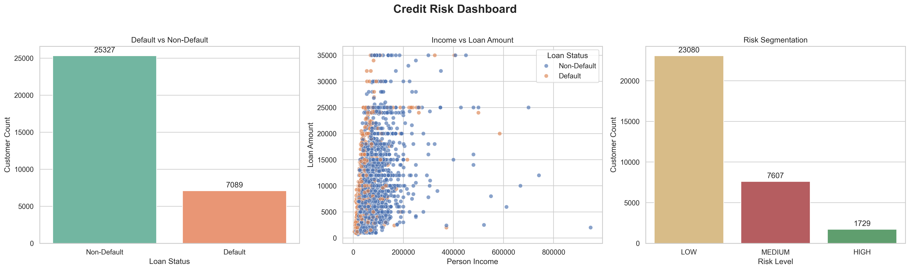

# Credit Risk Analysis

End-to-end data pipeline for credit risk analysis including data quality validation, feature engineering, SQL analytics, exploratory data analysis, and dashboard-ready visual outputs.

## Objective

This project analyzes borrower-level credit data to understand the key factors associated with loan default and to organize the data into a clean, reusable analytics workflow. The project is designed as a portfolio-ready data analytics case study with a clear progression from raw data to reporting assets.

The primary objectives are to:

- clean and standardize the raw dataset
- validate data quality through missing-value, duplicate, and outlier checks
- engineer risk-focused features for analysis and reporting
- identify the main drivers of loan default through EDA
- support SQL analysis and business intelligence dashboarding

## Architecture

`Raw Data -> Cleaning -> Quality Checks -> Feature Engineering -> SQL -> Visualization`

## Pipeline

1. **Raw Data**
   - Input file: `data/raw/credit_risk_dataset.csv`

2. **Cleaning**
   - Script: `scripts/cleaning.py`
   - Removes exact duplicates
   - Imputes missing numeric values with the median
   - Standardizes column names and categorical text
   - Output: `data/cleaned/credit_risk_dataset_cleaned.csv`

3. **Quality Checks**
   - Script: `scripts/quality_checks.py`
   - Calculates missing value percentages
   - Detects duplicate records
   - Flags numeric outliers using the IQR method
   - Output: `outputs/reports/credit_risk_quality_report.txt`

4. **Feature Engineering**
   - Script: `scripts/feature_engineering.py`
   - Creates:
     - `loan_to_income_ratio`
     - `residual_income_after_loan`
     - `employment_tenure_band`
     - `risk_level`
   - Output: `data/featured/credit_risk_dataset_featured.csv`

5. **Exploratory Data Analysis**
   - Script: `scripts/eda.py`
   - Evaluates categorical and numeric relationships with `loan_status`
   - Summarizes default rates across customer and loan segments
   - Output: `outputs/reports/loan_default_eda_report.txt`

6. **Visualization**
   - Scripts:
     - `scripts/visualization.py`
     - `scripts/dashboard.py`
   - Outputs:
     - `outputs/plots/default_vs_non_default.png`
     - `outputs/plots/income_vs_loan.png`
     - `outputs/plots/risk_segmentation.png`
     - `outputs/plots/dashboard.png`

7. **SQL Analysis**
   - Script: `sql/credit_risk_analysis.sql`
   - Provides database table creation and example analytical queries for featured data

## Tools Used

- **Python** for data preparation, feature engineering, EDA, and reporting
- **Pandas** for tabular transformation and statistical summaries
- **NumPy** for numerical operations and binning support
- **Matplotlib** for chart generation
- **Seaborn** for statistical visualizations
- **SQL (PostgreSQL-style)** for storage and analytical querying
- **Power BI** for dashboard planning and stakeholder-facing reporting

## Insights

The dataset shows several strong patterns linked to loan default:

- Higher `loan_to_income_ratio` is strongly associated with default risk
- Higher `loan_int_rate` aligns with much higher default rates
- Lower-income borrowers default more often than higher-income borrowers
- Borrowers with previous defaults are substantially riskier
- Worse loan grades are linked to sharply increasing default rates
- Renters default more often than owners or mortgage holders
- Shorter employment tenure is associated with higher default frequency
- The engineered `risk_level` feature separates low-, medium-, and high-risk segments effectively

## Project Structure

```text
credit-risk-analysis/
├── data/
│   ├── raw/
│   │   └── credit_risk_dataset.csv
│   ├── cleaned/
│   │   └── credit_risk_dataset_cleaned.csv
│   └── featured/
│       └── credit_risk_dataset_featured.csv
├── scripts/
│   ├── cleaning.py
│   ├── quality_checks.py
│   ├── feature_engineering.py
│   ├── eda.py
│   ├── visualization.py
│   └── dashboard.py
├── sql/
│   └── credit_risk_analysis.sql
├── outputs/
│   ├── reports/
│   │   ├── credit_risk_quality_report.txt
│   │   └── loan_default_eda_report.txt
│   └── plots/
│       ├── default_vs_non_default.png
│       ├── income_vs_loan.png
│       ├── risk_segmentation.png
│       └── dashboard.png
├── README.md
├── requirements.txt
└── .gitignore
```

## Dashboard Preview



## How To Run

From the project root:

```powershell
python scripts/cleaning.py
python scripts/quality_checks.py
python scripts/feature_engineering.py
python scripts/eda.py
python scripts/visualization.py
python scripts/dashboard.py
```

## Outputs

- Cleaned dataset: `data/cleaned/credit_risk_dataset_cleaned.csv`
- Featured dataset: `data/featured/credit_risk_dataset_featured.csv`
- Quality report: `outputs/reports/credit_risk_quality_report.txt`
- EDA report: `outputs/reports/loan_default_eda_report.txt`
- Plots: `outputs/plots/`

## Summary

This project demonstrates a complete analytics workflow for credit risk analysis, from raw data ingestion to cleaned datasets, feature engineering, SQL analysis, exploratory reporting, and dashboard-ready visuals. It is structured to be easy to review on GitHub and practical to extend for machine learning or BI use cases.
